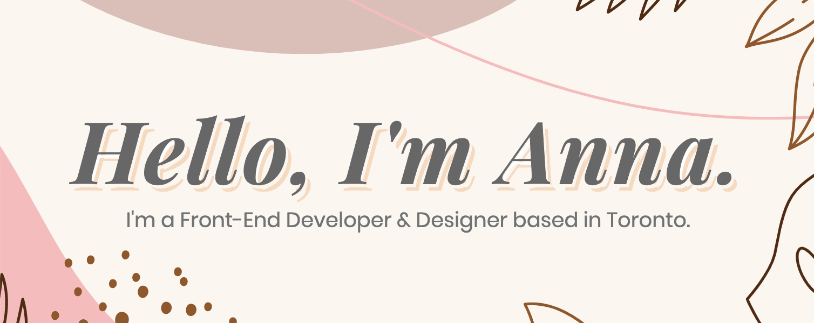

 

My journey into web development and design all began on a website I frequented as a child called Neopets which inspired me to learn HTML and CSS at a young age.

Now as an adult, I've rekindled my love for coding and have gone on to expand upon my previous skill set and knowledge, but one thing that remains the same is my desire to creatively solve problems through code and to help make the web a pleasing and user-friendly experience for all.

- 🏗 I’m currently working on an online photo editing app with fellow Juno grad, <a href="https://piklinhoe.com/">Pik Lin Hoe</a>
- 🎓 I’m currently enrolled in Juno College of Technology's part-time UX Design course
- 🤓 Outside of class, I'm currently learning Redux, Testing (unit, integration, end to end) and Node.js
- 🤔 I’m looking for help with how to win my 1st crown in <a href="https://en.wikipedia.org/wiki/Fall_Guys">Fall Guys</a>
- 💬 Ask me about all things design related.
- 😄 Pronouns: she/her
- ⚡ Outside of coding, I enjoy board games, video games, karaoke and cooking with friends.
